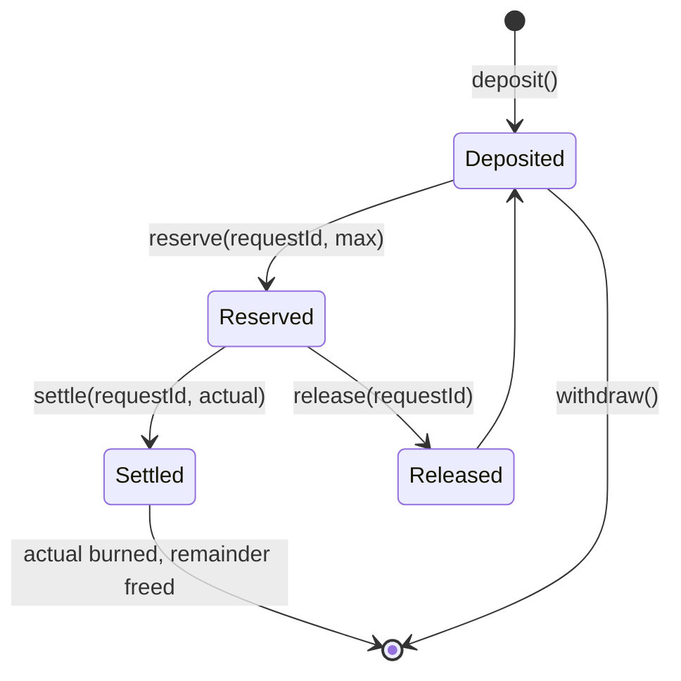

# accred-contracts

Solidity contracts for [Accred](https://github.com/useAccred/accred) on Robinhood Chain.

```text
src/CreditTerminal.sol          All contracts and test mocks
test/CreditTerminal.t.sol       Foundry-style tests
test/compile.mjs, run.mjs       solc compile + local-chain runner (no Foundry required)
scripts/                        prepare-artifacts, deploy-mainnet, deploy-staking
verification/                   Standard-input JSON for explorer verification
deployment.mainnet.json         Deployed addresses
deployment.manifest.json        Deployment manifest and compiler settings
```

Verification standard-input: [`contracts/verification`](../contracts/verification).

## Deployment (Robinhood Chain Mainnet, chain ID 4663)

| Contract | Address |
| --- | --- |
| `LLMCredit` (CREDIT, 18 decimals) | `0x854Af176109Cf2b377E2f90C25e57F4A67f10cf4` |
| `LLMCreditVault` | `0xE030BABE6CFD26042C71515C153C4b35bbA4e56A` |
| `TreasuryCreditPurchase` | `0xaA152Bb6217a8B4790346E9461A06B02d4E91a06` |
| `SolanaCreditSettlement` | `0x1Fea14500Be73fEFA0c904Cd4343193cdD4f3364` |
| `LLMCreditRedeemer` | `0x412d9C246810Be376Af474d4785447a26C218F1c` |
| `CreditStaking` | `0x2f696C76Bf71a93b5c3448763732a37e81CbDB06` |
| USDG | `0x5fc5360D0400a0Fd4f2af552ADD042D716F1d168` |

Machine-readable: [`contracts/deployment.mainnet.json`](../contracts/deployment.mainnet.json). Deploy block `77597442`.

## Contract summary

| Contract | Purpose | Key functions |
| --- | --- | --- |
| `LLMCredit` | Credit ERC-20. Owner manages minters and burners. | `mint`, `burn`, `burnFrom`, `setMinter`, `setBurner` |
| `LLMCreditVault` | User-owned credit held against gateway-authorized API requests. | `deposit`, `withdraw`, `reserve`, `settle`, `release`, `available`, `setGateway` |
| `TreasuryCreditPurchase` | EIP-712 signed-quote purchase of credit for an eligible input token. | `settle`, `setEligibleInput` |
| `ProjectTokenPurchase` / `ProjectTokenBurnAddressPurchase` | Project token purchase variants (burn on receipt or dead-address burn). | `purchase` |
| `CreditStaking` | Locks credit for 3 / 7 / 30 days. | `stake`, `claim`, `emergencyWithdraw` |
| `SolanaCreditSettlement` | Credit issuance for verified Solana payments via signed quote. | `settle` |
| `LLMCreditRedeemer` | Quote-signed redemption path with owner funding and withdrawal. | `redeem`, `fund`, `withdraw`, `setQuoteSigner` |
| `CashbackClaimVault` | Signed-claim cashback with per-user nonces. | `claim`, `fund`, `prune` |

## Vault lifecycle



## Staking terms

| Lock | Reward (of credit value in USD) |
| --- | --- |
| 3 days | 3.50% |
| 7 days | 5.00% |
| 30 days | 9.99% |

`payout = credits × bps / 10000 / 100` in USDG (6 decimals), recorded at stake time. The contract holds only credit principal; the reward is paid in USDG wallet to wallet after `claim`.

## Safety properties

- Quotes are EIP-712 typed, bound to chain ID, user, token, amount, deadline and a single-use nonce.
- `transferFrom` balance deltas are checked, so fee-on-transfer or no-op tokens cannot short-change a purchase.
- Vault operations are `nonReentrant` and gateway-gated; a reservation can be settled or released exactly once.
- Contracts that can hold tokens (`CreditStaking`, `LLMCreditRedeemer`) expose owner-only recovery.
- Test suite includes adversarial token mocks (no-op transfer, false-returning burn, reentrant callbacks).

## Build, test, deploy

```bash
cd contracts
pnpm install
pnpm test                       # compile + local-chain tests
pnpm run prepare:artifacts      # ABI/bytecode for deploy scripts
node scripts/deploy-mainnet.mjs # requires deployer key and RPC in the environment
node scripts/deploy-staking.mjs
```

## License

MIT © 2026 Accred
